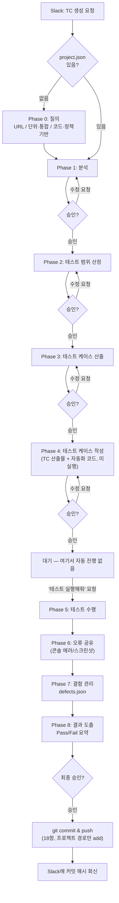

# TC 자동화 파이프라인 설계 문서 (Slack 연동)

> 상태: **설계안 (미구현)** — 실제 Slack Bot/서버 구축 전, 요청→생성→수정→컨펌→커밋까지 전체 흐름과 필요 구성요소를 정의합니다.
> 관련 문서: `.agents/AGENTS.md` (16~18항), `.agents/skills/qa-test-case-generator/SKILL.md`

---

## 1. 목표

- Slack에서 **TC 생성 요청**을 하면 Claude가 정책서/화면설계서/요구사항(`{프로젝트명}\Policy\SB\Requirements`)을 근거로 TC를 생성한다.
- 생성된 TC에 대해 Slack에서 **수정 요청**을 이어갈 수 있다.
- **컨펌(승인)**이 나면 `tc-automation` 저장소에 커밋 → GitHub(`13ongdal-create/tc-automation`)로 push 된다.
- 전체 과정이 Slack 채널/스레드에 기록으로 남아, 누가 언제 무엇을 요청·승인했는지 추적 가능해야 한다.

---

<!-- [수정 전 2026-08-18] Phase1~3을 한 번에 진행하고 Phase4 전에만 승인받던 2-게이트 버전.
사용자 요청으로 모든 Phase를 개별 요청/승인 기반으로 세분화 (AGENTS.md 13항 Phase 0~8).

flowchart TD
    A["Slack: TC 생성 요청\n(@Claude 또는 슬래시커맨드)"] --> B["근거 문서 확보\nPolicy / SB / Requirements 스캔"]
    B --> C["Phase 1~3: 시나리오 검토표 제출"]
    C --> D{"Slack 스레드에서\n승인?"}
    D -- "수정 요청" --> E["범위/우선순위 조정 후 재제출"]
    E --> C
    D -- "승인" --> F["Phase 4: HTML/JSON TC 산출물 생성"]
    F --> G["{프로젝트명}\\TC\\ 에 파일 저장"]
    G --> H["Slack 스레드에 결과 요약 + 산출물 공유"]
    H --> I{"최종 컨펌?"}
    I -- "수정 요청" --> J["해당 TC만 부분 수정"]
    J --> H
    I -- "승인" --> K["git commit & push\n(AGENTS.md 18항 커밋 규칙)"]
    K --> L["Slack에 커밋/PR 링크 회신"]

핵심 설계 원칙:
- Phase 3(시나리오 검토표) 승인 없이 Phase 4(실제 TC 대량 생성)로 넘어가지 않는다.
- Git 커밋은 사용자가 Slack에서 명시적으로 승인한 시점에만 발생한다 (자동 커밋 금지).
- 모든 요청/수정/승인 발화는 Slack 스레드에 그대로 남아 감사 로그(audit log) 역할을 한다.
-->

## 2. 전체 흐름 (개념도)

AGENTS.md 13항의 Phase 0~8을 그대로 따른다. **모든 화살표가 개별 승인/요청 게이트**이며, 특히 Phase 4 → Phase 5(테스트 실행)는 자동으로 이어지지 않고 **반드시 별도 요청**이 있어야 한다.

**핵심 설계 원칙**
- Phase 0~8 각각이 독립된 요청/승인 게이트다. 여러 Phase를 한 응답에 묶어 진행하지 않는다.
- **Phase 4(TC 작성) 승인 ≠ Phase 5(테스트 실행) 시작.** 테스트 실행은 `테스트 실행해줘`/`테스트 수행해줘` 같은 별도 발화가 있어야만 시작된다 (6장 발화 규칙 참조).
- Git 커밋은 **Phase 8(결과 도출) 이후 사용자가 명시적으로 승인한 시점**에만 발생한다 (자동 커밋 금지).
- 모든 요청/수정/승인 발화는 Slack 스레드에 그대로 남아 감사 로그(audit log) 역할을 한다.

---

## 3. 아키텍처 옵션

Slack 연동은 **"어디서 Claude가 실행되는가"**에 따라 두 갈래로 나뉜다. 각 옵션의 전제조건과 트레이드오프를 정리한다.

### 옵션 A. Claude Tag(Claude in Slack) + GitHub Access Bundle

Anthropic이 제공하는 공식 Slack 통합 기능(`Claude Tag`, `claude.ai/admin-settings/claude-tag`)을 사용하는 방식.

**동작 방식**
- Slack 채널에서 `@Claude TC 생성해줘` 형태로 멘션하면, Anthropic이 호스팅하는 샌드박스에서 Claude가 실행된다.
- 정책서/화면설계서/요구사항 및 `tc-automation` 저장소 자체를 **GitHub Access Bundle**로 연결해두면, Claude Tag가 저장소 파일을 읽고 커밋/PR까지 생성할 수 있다.

**전제조건 (중요 제약)**
- **Team/Enterprise 플랜 전용** (Free/Pro/Max 불가) — 워크스페이스 Owner가 사전 설정 필요.
- Claude Tag는 **로컬 PC 파일시스템에는 접근 불가** (샌드박스 실행) → 정책서 등 근거 문서가 반드시 GitHub(현재 `tc-automation` 저장소)에 먼저 올라가 있어야 한다. (이번 작업에서 이미 push 완료했으므로 충족됨)
- 현재 `.agents\AGENTS.md`/`SKILL.md`의 스킬 규칙을 그대로 태우려면, 이 규칙 문서도 저장소에 포함되어 Claude Tag가 참조할 수 있어야 한다.
- 버튼/모달 기반 승인 UI는 **공식 문서에 명시되어 있지 않음** — 승인은 "스레드 답장"(텍스트) 기반으로 처리해야 한다.

**장점**: 별도 서버/인프라 구축 불필요, Anthropic이 운영·보안 관리.
**단점**: 플랜 업그레이드 필요, 로컬 전용 도구(pandoc/exceljs 등 docx·xlsx 파싱) 사용 불가 — 근거 문서를 미리 텍스트/마크다운으로 변환해 저장소에 올려둬야 함.

---

### 옵션 B. 커스텀 Slack App + Claude Code CLI 브릿지

현재처럼 로컬 Windows 환경에서 Claude Code(현재 이 세션과 동일한 방식)로 TC를 생성하고, Slack은 트리거/알림 창구 역할만 하는 방식.

**구성 요소**
| 구성요소 | 역할 |
|---|---|
| Slack App (Bot Token + Signing Secret, Slash Command 또는 Events API 구독) | 사용자의 생성/수정/승인 요청 수신, 결과 발신 |
| 상시 구동 서버 (로컬 상시 PC 또는 소형 클라우드 VM, Node.js/Python) | Slack 이벤트 수신 → `claude -p "..."` 형태로 Claude Code CLI를 headless 호출 |
| `tc-automation` Git 저장소 (완료) | Claude Code가 실제로 읽고 쓰는 대상 |
| GitHub 저장소 (완료: `13ongdal-create/tc-automation`) | push 대상, PR 생성 시 리뷰/승인 이력 보관 |

**동작 방식**
1. 사용자가 Slack에서 `/tc-generate 프로젝트=ABC마트 모듈=장바구니` 같은 슬래시커맨드 실행.
2. 서버가 이벤트를 받아 `claude -p` 로 `.agents` 규칙 + 해당 프로젝트 폴더를 컨텍스트로 CLI 실행.
3. Phase 3 결과(시나리오 검토표)를 서버가 Slack Block Kit 메시지로 변환해 게시, **승인/수정요청 버튼** 첨부.
4. 버튼 클릭 시 Slack이 서버의 Interactivity 엔드포인트로 콜백 → 서버가 승인/반려를 CLI에 전달 후 다음 Phase 진행.
5. 최종 승인 시 서버가 `git add/commit/push` 실행 (AGENTS.md 18항 커밋 메시지 규칙 그대로 적용) 후 커밋 링크를 Slack에 회신.

**장점**: 플랜 제약 없음(Free/Pro도 가능), 로컬 도구(pandoc/exceljs) 그대로 재사용 가능, 버튼 기반 승인 UI 자유롭게 구현 가능.
**단점**: 서버를 별도로 구축·운영해야 함(상시 구동, 재시작 관리, 외부에서 접근 가능한 endpoint 필요 — 예: Cloudflare Tunnel/ngrok 또는 클라우드 VM), Slack App 등록 및 워크스페이스 관리자 승인 필요, 직접 유지보수 부담.

---

## 4. 비교 요약

| 항목 | 옵션 A: Claude Tag | 옵션 B: 커스텀 Bot + CLI 브릿지 |
|---|---|---|
| 플랜 요구사항 | Team/Enterprise 전용 | 제약 없음 |
| 인프라 구축 | 불필요 | 서버 구축·운영 필요 |
| 로컬 파일(docx/xlsx) 직접 파싱 | 불가 (사전에 GitHub 반영 필요) | 가능 (현재 방식 그대로) |
| 승인 UX | 텍스트 답장 기반 | Block Kit 버튼 등 자유 설계 |
| 구현 난이도 | 낮음 (설정만) | 높음 (개발+운영) |
| 보안 범위 | Anthropic 샌드박스 + Access Bundle 권한 범위 | 직접 통제 가능 |

---

## 5. 권장 로드맵

1. **현재 단계 (완료)**: `tc-automation` Git 저장소화, 프로젝트별 `Policy/SB/Requirements/TC` 표준 구조 확립, GitHub push. Slack 없이 Claude Code로 직접 요청하는 현행 방식 유지.
2. **1단계 (PoC)**: 옵션 B를 **가장 작은 범위**로 시험 — 특정 Slack 채널 하나 + 슬래시커맨드 1개(`/tc-generate`)만 구현, 승인은 우선 텍스트 답장("승인" 입력) 방식으로 단순화. 서버는 사용자 PC에서 상시 구동하거나 소형 VM에 배포.
3. **2단계**: PoC가 안정되면 Block Kit 버튼 기반 승인/수정 UI 추가, 프로젝트별 채널 분리 또는 채널 내 스레드 분리 규칙 확정.
4. **장기 검토**: 워크스페이스가 Team/Enterprise 플랜으로 전환되는 시점에 옵션 A(Claude Tag) 도입을 재검토 — 서버 운영 부담을 없애는 대신, 근거 문서를 Git 저장소에 지속적으로 최신화해두는 프로세스가 선행되어야 한다.

---

## 6. Slack 발화 규칙 (초안 — 옵션 B 기준)

| 발화 유형 | 형식 예시 |
|---|---|
| TC 생성 요청 | `/tc-generate 프로젝트=ABC마트 모듈=장바구니` (목표 건수는 미리 정하지 않음 — 도출 가능한 최대치를 그대로 산출) |
| TC 생성 요청 (URL 기반, 코드형) | `/tc-generate 프로젝트=ABC마트 모듈=장바구니 URL=https://abc-mart.example.com/cart` — Playwright로 실제 화면을 관찰해 근거로 삼음. Phase 4(TC 작성)까지만 진행되며, **자동화 테스트 실행은 아래 "테스트 실행 요청"을 별도로 해야 시작됨** |
| 테스트 실행 요청 (Phase 5, 스레드 내) | `테스트 실행해줘` / `테스트 수행해줘` / `test run` — Phase 4가 승인된 뒤 이 발화가 있어야만 Playwright 자동화 테스트를 실행. Phase 4 승인만으로는 자동 실행되지 않음 |
| 테스트 실행 요청 (Phase 5, 독립 진입점) | `/tc-test 프로젝트=ABC마트 모듈=장바구니` — TC 생성 스레드 없이도, 이미 생성된 자동화 테스트 코드를 그대로 재실행 (회귀 테스트 등) |

**콘솔 에러 + 스크린샷 자동 첨부**: 자동화 테스트는 공통 fixture(`_shared/testFixtures.js`)를 통해 브라우저 콘솔 에러/실패 API 요청을 자동 감지하며, 감지 시 어서션 통과 여부와 무관하게 해당 TC를 실패 처리하고 스크린샷을 남깁니다. Claude는 최종 응답에 `SCREENSHOT: {경로}` 줄을 남기고, `slack-bridge/src/resultReporter.js`가 이를 파싱해 Slack 스레드에 이미지 파일로 첨부합니다 (Slack App에 `files:write` 스코프 필요).

**Phase 1~3 자동 연속 진행 + 이슈 실시간 알림 (`/tc-generate` 한정, 2026-08-19)**: Slack에서 TC 생성을 요청하면 Phase 1~3은 승인 없이 연속으로 진행되고, Phase 3 완료 시 마크다운 표 요약을 제시해 그 시점에만 승인을 받습니다(AGENTS.md 13항). 이 구간(Phase 1~4)에서 이슈/에러를 발견하면 Claude는 그때그때 `ISSUE_ALERT: {설명}` 줄을 출력하고, `slack-bridge/src/claudeRunner.js`가 스트리밍 중인 stream-json 이벤트에서 이 줄을 실시간으로 감지해 최종 응답을 기다리지 않고 즉시 스레드에 `:rotating_light:` 알림을 올립니다 (`SCREENSHOT:`과 동일한 마커 기반 실시간 릴레이 패턴).
| TC 수정 요청 (스레드 내) | `TC_CRT_012 우선순위를 P1로 변경해줘` |
| 승인 | `승인` / ✅ 버튼 |
| 반려·재작업 | `반려: 사유` / ✏️ 버튼 |
| 중단 | `중단` / `취소` / `그만` / `stop` / `cancel` — 실행 중인 프로세스를 트리 전체 강제 종료 (구현 완료, v0.1) |
| 진행 상태 조회 | `상태` / `진행상황` / `progress` — 실행 중인 claude CLI의 스트리밍 출력(`--output-format stream-json`)에서 뽑아둔 "마지막 작업 내용"을 즉시 응답. **Claude 재호출 없음(토큰 미사용)** |
| 결함 현황 조회 | `/tc-defects 프로젝트=ABC마트` — defects.json을 코드로 직접 집계/표로 응답. **Claude 호출 없음(토큰 미사용)** |
| 결함 담당자/상태/이슈링크 변경 | `DEF_xxx 담당자를 홍길동으로 지정해줘`, `DEF_xxx 완료 처리해줘` 등 정형 패턴은 `defectFastPath.js`가 Claude 없이 직접 처리. **매칭 안 되는 자유 형식 요청만** 그때 Claude 세션을 지연 시작(lazy start) |

- 모든 요청은 **프로젝트명을 필수로 포함**해야 하며(다중 프로젝트 구조 대응), 프로젝트명이 없으면 서버가 "어떤 프로젝트인가요?"로 되묻는다.
- 승인 발화는 **요청을 올린 사람 또는 채널 내 지정된 승인자만** 유효하게 처리한다 (권한 검증은 옵션 B 서버 구현 시 필수).
- **토큰 최소화 원칙**: 결정론적으로 코드만으로 처리 가능한 요청(상태 집계, 정형 필드 수정, 진행 상황 조회)은 Claude를 거치지 않는다. 자연어 이해가 실제로 필요한 경우(TC 생성/수정, 자유 형식 결함 문의 등)에만 Claude를 호출한다.

**평일 자동 노션 현황 보고 (2026-08-20)**: `slack-bridge/src/dailyReport.js`가 평일(월~금) 10:00(KST)마다 `node-cron`으로 자동 기동되어, tc-automation/agents-config/slack-bridge 세 저장소의 `git log`를 확인하고 두 노션 페이지("🤖 큐돌이", "📘 Claude QA 자동화")의 "업데이트 이력" 표에 그날 변경사항(없으면 "변경사항 없음")을 기록합니다. 이 실행은 관찰+노션 기록만 하며 코드 수정/커밋/테스트 실행은 하지 않습니다. Slack 브릿지 서버 프로세스에 종속된 스케줄이라 **서버가 켜져 있는 한 사용자가 종료를 요청하기 전까지 무기한 실행**됩니다(`.env`의 `DAILY_REPORT_ENABLED=false`로 끌 수 있음, 반영하려면 서버 재시작 필요). 사용자가 특정 날짜 보고에 포함하고 싶은 특별 요청사항이 있으면, 다음 실행 전에 `slack-bridge/data/dailyReportPending.txt`에 그 내용을 적어두면 해당 회차 보고에 반영되고 파일은 자동으로 비워집니다.

---

## 7. 보안/권한 고려사항

- `Policy/SB/Requirements`에는 사내 정책·미공개 화면설계서가 포함될 수 있음 — GitHub 저장소를 **Private**로 유지하고, Slack 채널도 관련 인원만 참여하는 비공개 채널로 운영한다.
- 옵션 A(Claude Tag) 도입 시 GitHub Access Bundle 권한은 `tc-automation` 저장소 단위로 최소화한다 (조직 전체 저장소 접근 부여 금지).
- 옵션 B 서버의 Slack Signing Secret/Bot Token, GitHub Push 권한(SSH key 또는 PAT)은 서버 환경변수로만 관리하고 저장소에 커밋하지 않는다.
