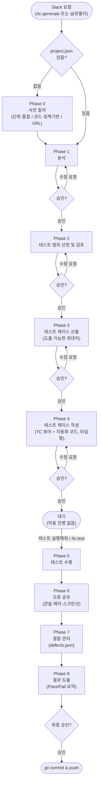

# PRD: TC 자동화 시스템 (큐돌이)

**문서 상태**: v1.1 (Draft)
**작성일**: 2026-08-18
**작성 조직**: 쓰리탑
**관련 저장소**: `tc-automation`, `agents-config`(구 `.agents`), `slack-bridge`

---

## 1. 개요

이커머스 서비스의 QA 테스트 케이스(TC) 설계·작성·실행·결함관리를 Slack에서 자연어/명령어로 요청하면, Claude Code가 정책서 또는 실제 서비스 화면을 근거로 TC를 설계하고, 승인에 따라 Playwright 자동화 테스트까지 직접 수행하는 사내 QA 자동화 시스템이다. Slack 봇 이름은 **큐돌이**이며, `#tc-automation` 채널에서 운영된다.

## 2. 배경 및 문제 정의

- 기존에는 QA 엔지니어가 정책서/화면설계서를 직접 읽고 TC를 수기로 작성했고, 프로젝트별로 산출물이 개인 PC나 각자의 문서함에 흩어져 관리되어 **이력 추적과 재사용이 어려웠다.**
- 실제 테스트 실행(특히 회귀성 반복 실행)은 별도 자동화 스크립트 없이는 매번 수동으로 이루어져, **테스트 실행 자체가 병목**이었다.
- 결함(버그) 발견 시 별도 이슈 트래커 없이는 상태·담당자 추적이 어려웠다.
- QA 인력 여러 명이 여러 프로젝트를 동시에 진행할 때, **요청 채널이 통일되어 있지 않아** 진행 상황 공유가 느렸다.

## 3. 목표

| 목표 | 설명 |
|---|---|
| TC 설계 자동화 | 정책서(docx) 또는 실제 서비스 URL을 근거로 Claude가 TC를 설계 |
| 테스트 실행 자동화 | 설계된 TC를 Playwright 코드로 변환해 실제로 실행, Pass/Fail 도출 |
| 결함 관리 일원화 | 실행 중 발견된 결함을 프로젝트별 대장(`defects.json`)에 자동 등록·추적 |
| 협업 채널 통합 | 모든 요청·검토·승인·실행을 Slack 한 곳에서 처리 |
| 프로젝트 단위 격리 | 여러 프로젝트를 동시에 진행해도 서로의 데이터·정책이 섞이지 않음 |
| 비용 효율 | 정형화된 반복 작업(조회, 필드 수정, 상태 확인)은 LLM 호출 없이 처리 |

## 4. 대상 사용자

| 페르소나 | 역할 | 주요 상호작용 |
|---|---|---|
| QA 엔지니어 | TC 설계 요청, 검토표 승인, 테스트 실행 요청 | `/tc-generate`, 스레드 내 승인/수정요청 |
| 기획자 | 정책/요구사항 기준 정의, Phase 1~3 산출물(분석·범위·시나리오) 검토 및 승인, 정책 해석 오류 확인 | Phase 1~3 결과 검토, 수정요청("정책 반영 안 됨" 등), `Requirements`/`Policy` 원본 제공 |
| QA 리드 / PM | 결함 현황 파악, 우선순위 조정 | `/tc-defects`, 결함 상태·담당자 변경 |
| 개발자 | 결함 확인, 재현 절차 참고 | 스레드 링크 공유받아 확인 |
| 시스템 운영자(현재: 요청자 본인) | 브릿지 서버 운영, 신규 프로젝트 온보딩 | 로컬 PC에서 `slack-bridge` 구동 |

## 5. 범위

**In Scope**
- Slack을 통한 TC 생성/수정/승인 요청 및 응답
- 정책서(docx) 기반 및 실제 URL(Playwright 관찰) 기반 TC 설계
- Playwright 기반 자동화 테스트 코드 생성 및 실행
- 브라우저 콘솔 에러/실패 API 요청 자동 감지 및 스크린샷 캡처
- 프로젝트별 결함 대장 관리 (등록/조회/상태변경/담당자지정)
- Git 기반 산출물 버전관리 (프로젝트 데이터, 행동 규칙, 봇 서버 코드)
- 서버 장애/네트워크 단절 알림

**Out of Scope (현재 버전 기준)**
- Jira 등 외부 이슈트래커 연동
- 로그인이 필요한 화면의 자동 관찰 (인증 세션 미지원)
- Slack Block Kit 버튼 기반 승인 UI (현재는 텍스트 기반)
- 다중 사용자 권한/승인자 검증 (현재는 누구나 승인 가능)
- 소스 코드 정적 분석/문법 오류 검출 (UI/기능 동작 검증만 수행)

## 6. 핵심 기능 요구사항

| # | 기능 | 요구사항 |
|---|---|---|
| F1 | 프로젝트 온보딩 | 신규 프로젝트는 `_template/` 스캐폴드에서만 생성. 다른 프로젝트 내용을 예시/근거로 참조 금지 |
| F2 | 사전 질의 (Phase 0) | 최초 요청 시 URL, 단위/통합 테스트 구분, 코드기반/정책기반 여부를 확인해 `project.json`에 저장 |
| F3 | 단계별 승인 | Phase 1(분석)~Phase 4(TC 작성)까지 각 단계 완료 시마다 개별 승인 필요. 여러 단계를 한 번에 진행하지 않음 |
| F4 | 무제한 커버리지 도출 | 목표 건수를 사전에 협의하지 않고, 근거에서 도출 가능한 최대치를 그대로 산출 |
| F5 | 테스트 실행 분리 | TC 작성(Phase 4) 승인과 무관하게, "테스트 실행해줘"(스레드 내) 또는 `/tc-test`(독립 진입점) 요청이 있어야만 자동화 테스트 실행 |
| F6 | 콘솔 에러 자동 감지 | 어서션 통과 여부와 무관하게 브라우저 콘솔 에러/4xx·5xx 응답 발생 시 해당 TC를 실패 처리하고 스크린샷 캡처 |
| F7 | 결함 자동 등록 | 테스트 실패 시 `defects.json`에 결함 레코드 자동 생성/갱신 (재발생 시 상태 복원) |
| F8 | 결함 관리 인터페이스 | `/tc-defects` 및 정형 패턴("담당자 지정", "완료 처리" 등)은 Claude 호출 없이 즉시 처리 |
| F9 | 프로젝트 단위 동시성 | 서로 다른 프로젝트(스레드)는 동시 처리 가능. Git 커밋 범위와 테스트 리포트 경로를 프로젝트 단위로 격리 |
| F10 | 중단/상태 조회 | 실행 중인 요청을 언제든 중단 가능. 진행 상태는 재호출 없이 즉시 조회 가능 |
| F11 | 장애 알림 | 서버 크래시, 네트워크 15분 이상 단절, 개별 요청 오류를 Slack Webhook으로 알림 |
| F12 | 버전 관리 | TC 산출물, 행동 규칙 문서, 봇 서버 코드 전체를 Git으로 관리 (로컬+원격) |

## 7. 사용자 워크플로우

### 7-1. 순서도



### 7-2. Phase 상세

| Phase | 명칭 | 트리거 | 수행 내용 | 산출물 | 승인 |
|---|---|---|---|---|---|
| 0 | 요청 접수 & 사전 질의 | 신규 프로젝트 또는 최초 요청 | URL, 단위/통합 구분, 코드/정책기반 확인 | `project.json` | 질의 응답 (승인 아님) |
| 1 | 분석 | Phase 0 완료 또는 기존 프로젝트 요청 | 정책서 또는 URL 관찰로 정책/기능 분석 | 분석 요약 | 필요 |
| 2 | 테스트 범위 산정 및 검토 | Phase 1 승인 | 커버리지 범위·모듈 배분 계획 수립 | 범위 계획 | 필요 |
| 3 | 테스트 케이스 산출 | Phase 2 승인 | 시나리오 목록 도출 (목표 건수 미리 정하지 않고 최대치 산출) | 시나리오 목록 | 필요 |
| 4 | 테스트 케이스 작성 | Phase 3 승인 | 상세 TC 작성 + HTML/JSON 뷰어 생성 (URL 기반이면 자동화 코드도 생성, 미실행) | TC HTML/JSON 뷰어 | 필요 |
| 5 | 테스트 수행 | 별도 요청 (`테스트 실행해줘` 또는 `/tc-test`) | Playwright 자동화 테스트 실행 | 실행 로그 | 불필요 (요청 자체가 트리거) |
| 6 | 오류 공유 | Phase 5 진행 중 자동 | 콘솔 에러/실패 즉시 보고 + 스크린샷 첨부 | Slack 스크린샷 | - |
| 7 | 결함 관리 | Phase 5 결과 자동 반영 + 이후 수시 요청 | `defects.json` 등록/갱신, 상태·담당자 관리 | 결함 대장 + TC 뷰어 내 결함현황 탭 | 등록은 자동, 상태변경은 요청 기반 |
| 8 | 결과 도출 | Phase 5~7 완료 | Pass/Fail 요약 리포트 | 최종 리포트 | 필요 (승인 시 git commit/push) |

> **산출물 형태**: TC 목록, 결함 현황, 실행결과(Pass/Fail)는 **하나의 TC HTML Interactive Viewer 안에 탭/컬럼으로 통합**되어 있으며, 별도의 개별 뷰어로 생성되지 않는다. 결함현황은 뷰어 내 "🐞 결함현황" 탭, 실행결과는 TC 테이블의 "실행결과" 드롭다운 컬럼으로 표현된다.

### 7-3. Slack 명령어

| 명령어 | 용도 |
|---|---|
| `/tc-generate 프로젝트=X 모듈=Y [URL=Z]` | TC 생성 요청 시작 (목표 건수는 지정하지 않음) |
| `/tc-test 프로젝트=X [모듈=Y]` | Phase 5(테스트 수행)를 독립적으로 시작 — 이미 생성된 자동화 테스트를 재실행 (회귀 테스트 등) |
| `/tc-defects 프로젝트=X` | 결함 현황 조회 (토큰 미사용) |
| `@큐돌이 자연어 요청` | 슬래시커맨드 없이 자연어로 TC 생성/결함조회 요청 |
| `승인` / `반려: 사유` | 다음 Phase 진행 / 현재 Phase 재작업 |
| `테스트 실행해줘` | (TC 생성 스레드 내에서) Phase 5 시작 |
| `상태` / `진행상황` | 현재 작업 내용 즉시 조회 (토큰 미사용) |
| `중단` | 진행 중인 요청 강제 종료 |
| `DEF_xxx 담당자를 OOO로 지정해줘` 등 | 결함 필드 변경 (토큰 미사용) |

## 8. 시스템 아키텍처

```
Slack (#tc-automation)
   │  Socket Mode (공개 URL/터널 불필요)
   ▼
slack-bridge (Node.js, 로컬 PC 상시 구동)
   │  claude CLI headless 호출 (--output-format stream-json)
   ▼
Claude Code (claude-sonnet-5, 쓰리탑 Team 플랜)
   │  Read/Write/Bash (AGENTS.md 규칙 기반, .claude/settings.json 허용목록)
   ▼
tc-automation/ (Git 저장소)
   ├── {프로젝트명}/Policy·SB·Requirements·TC   ← TC 산출물, 자동화 테스트 코드, defects.json
   ├── _shared/, _reference/, _template/
   └── Playwright (Chromium) 실행 → GitHub push
```

- **agents-config** 저장소: Claude의 행동 규칙(AGENTS.md, SKILL.md) — 시스템의 "두뇌"
- **slack-bridge** 저장소: Slack ↔ Claude Code 연결 서버 코드
- **tc-automation** 저장소: 실제 TC/결함/정책서 데이터 (프로젝트별 폴더)

## 9. 비기능 요구사항

| 항목 | 요구사항 |
|---|---|
| 토큰 비용 효율 | 결정론적으로 처리 가능한 작업(상태 집계, 정형 필드 수정, 진행상태 조회)은 Claude 미호출 |
| 동시성 | 프로젝트(스레드) 간 동시 요청 처리 가능, 같은 스레드 내에서는 순차 처리 강제 |
| 데이터 격리 | 프로젝트 간 정책/TC/근거 자료를 상호 참조하지 않음 |
| 가용성 알림 | 서버 다운·네트워크 단절 시 별도 Webhook으로 통지 (평시에는 알림 최소화) |
| 버전 관리 | 시스템 전 구성요소(규칙 문서/서버 코드/데이터)가 Git으로 로컬+원격 이중 백업 |
| 보안 | 신뢰할 수 있는 자사 URL만 관찰 대상으로 사용 (제3자 사이트의 프롬프트 인젝션 위험 방지) |

## 10. 성공 지표 (제안)

| 지표 | 설명 |
|---|---|
| TC 커버리지 도출 건수 | 프로젝트/모듈당 도출된 시나리오 수 (사전 목표치 없이 최대치 측정) |
| 자동화 테스트 통과율 | Phase 5 실행 결과 Pass/Fail 비율 |
| 결함 재발생률 | `재발생` 상태로 전환된 결함 비율 |
| 토큰 미사용 처리 비율 | 전체 Slack 상호작용 중 Claude 미호출로 처리된 비율 |
| 평균 리드타임 | 요청(Phase 0) → 결과 도출(Phase 8)까지 소요 시간 |

## 11. 리스크 및 제약사항

| 리스크 | 설명 | 대응 |
|---|---|---|
| 헤드리스 실행 시간 | 정책서 다건 분석 시 30분 이상 소요 가능 | 캐싱(9항), 진행상태 조회, 배치 분할 |
| 승인 단계 증가로 인한 오버헤드 | Phase별 개별 승인으로 왕복 횟수 증가 | 트레이드오프로 인지, 필요시 재검토 |
| 단일 운영 PC 의존 | 브릿지 서버가 현재 1대 PC에서만 구동 | 추후 클라우드 서버 이전 시 `.env`만 이전하면 되도록 설계됨 |
| 프롬프트 인젝션 | 제3자 URL 관찰 시 악성 지시문 삽입 가능성 | 자사 신뢰 URL로 한정, 관찰 결과를 "데이터"로만 취급 |
| 수동 GitHub 조작 충돌 | 저장소를 웹 UI에서 직접 수정 시 예기치 않은 변경 발생 가능 | 가능한 한 Slack/Claude 경로로만 변경, 직접 조작 지양 권장 |

## 12. 향후 로드맵 (제안)

1. Slack Block Kit 버튼 기반 승인 UI 도입 (텍스트 승인 → 클릭 승인)
2. 승인자 권한 검증 (요청자 또는 지정 승인자만 유효)
3. 브릿지 서버 클라우드 이전 검토 (PC 상시 구동 의존 해소)
4. Team/Enterprise 플랜 활용도 확대 시 Claude Tag(공식 Slack 통합) 병행 검토
5. Jira 등 외부 이슈트래커 연동 옵션화

---

*본 문서는 `tc-automation/_reference/PRD.md`에 버전관리됩니다. 시스템 변경 시 함께 갱신합니다.*
